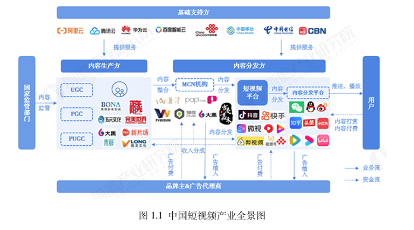
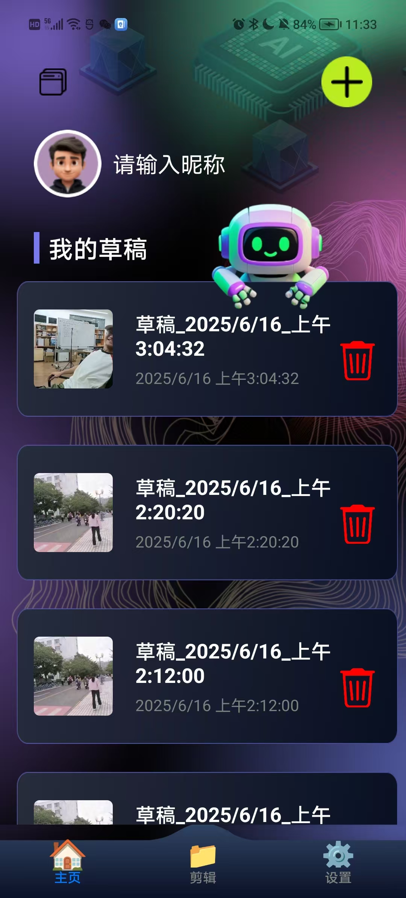
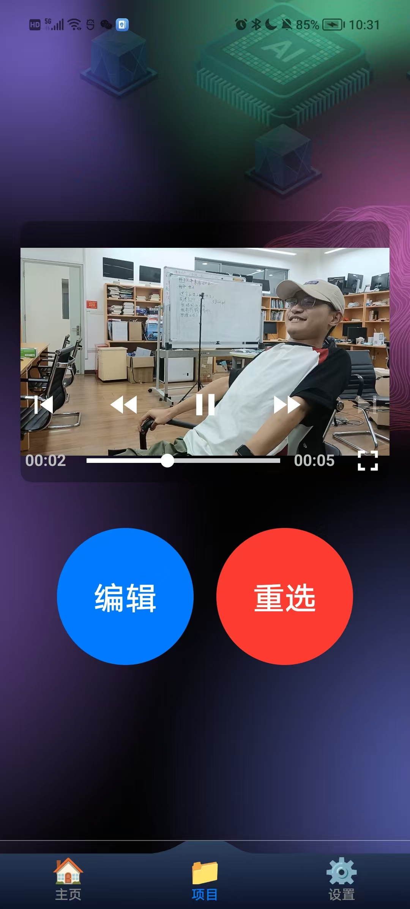
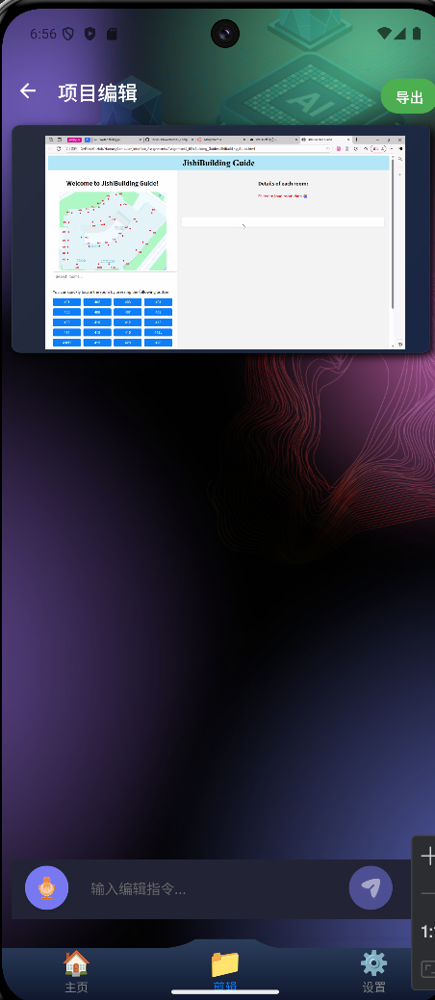
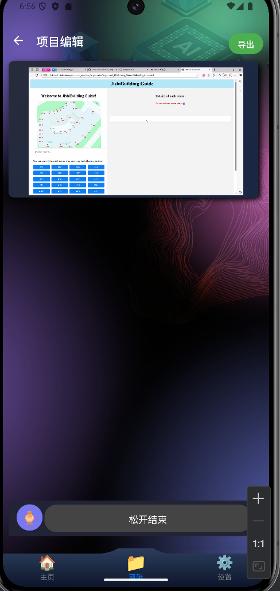
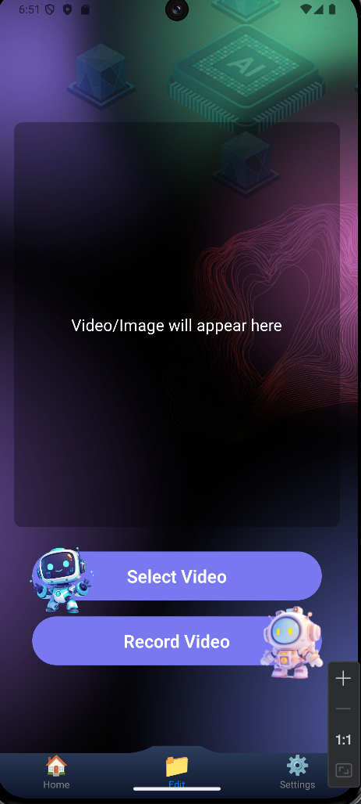
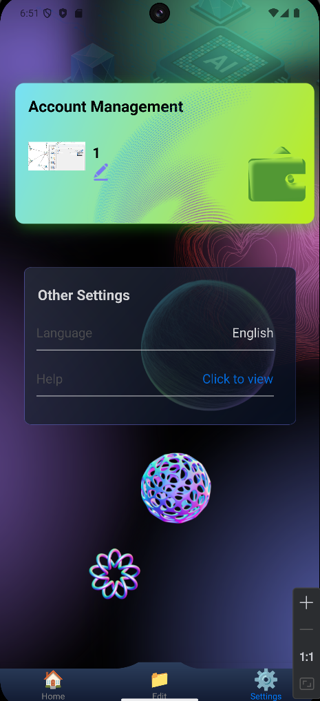

# ClipNova Documentation

> ClipNova: One-click video production and AI intelligent editing lead to a new experience of efficient video creation.
>
> ClipNova：一键成片、AI 智能剪辑，引领高效视频创作新体验。
>
> 

## 1 项目概述

### 1.1 项目背景

#### 1.1.1 社会背景

随着短视频平台（如抖音、快手、YouTube Shorts、小红书等）的兴起，视频内容创作迎来了前所未有的增长期。大量内容创作者、企业营销团队以及教育机构正在不断生产视频内容，但传统的视频剪辑流程仍然存在诸多痛点：

1. **创作门槛高**：传统剪辑软件（如Premiere、Final Cut）操作复杂，普通用户需投入大量时间学习；
2. **效率瓶颈突出**：自媒体从业者需日更视频，但剪辑耗时占全流程70%以上，严重制约产出能力；
3. **产出效率低**：内容更新节奏快，但剪辑速度跟不上。

在 AIGC（生成式人工智能）迅猛发展的背景下，AI 已逐渐成为提升创作效率与内容质量的重要工具。ClipNova 正是在这一背景下诞生，旨在以 AI 技术赋能视频创作，简化操作流程，提高内容生成效率。

### 1.2 项目目标
ClipNova 的建设目标是打造一款集 自动剪辑、智能理解、创意生成、个性化配置 于一体的智能剪辑平台。具体目标包括：

1. **提供语义级剪辑**：基于多模态模型理解视频内容，智能生成逻辑清晰的片段。
2. **降低创作门槛**：让非专业用户也能通过一键剪辑获得高质量输出。
3. **支持个性化风格**：适配不同创作风格与需求，支持微调与模板定制。
4. **构建开放接口**：为企业和创作者提供批量剪辑与内容管理能力。

## 2 市场分析

### 2.1 市场背景与行业痛点

1. **内容生产井喷**：抖音、快手、B站、小红书等短视频平台的兴起使得内容产能成为核心竞争力；
2. **剪辑耗时耗力**：传统视频剪辑周期长、门槛高，不利于高频率内容输出；
3. **创作者压力加剧**：大多数创作者需要兼顾拍摄、剪辑、运营等多个环节，内容更新压力巨大；
4. **现有工具智能性不足**：多数剪辑工具仍停留在工具属性阶段，缺乏语义分析与创意支持。

### 2.2 市场需求与潜力

**短视频日活跃用户数超过10亿，内容年产量超百亿条**，对高效剪辑工具的需求持续增长；
**企业品牌、教育培训、直播行业等垂类**也对短视频内容质量提出更高要求；
预计到**2027年全球智能视频编辑市场规模将突破180亿美元**，AI 剪辑工具有望成为下一个内容基础设施。

### 2.3 竞争分析

#### 2.3.1 竞争环境

一些已经在市场上占据领导地位的视频创作软件，如剪映、Runway、Descript等，这些软件往往有更大的用户基数，提供丰富的创作模版和全面的的剪辑工具。

#### 2.3.2 竞品分析

1. **剪映**：字节跳动出品的全民级剪辑工具，适配抖音生态。以下是对剪映的优势和劣势的分析：
   * **优势**：
     * 与抖音深度绑定，内容适配强
     * 模板丰富、风格多样，适合快速出片
     * 操作门槛低，支持云端协作
   * **劣势**：
     * 依赖人工操作为主，缺乏语义理解与智能剪辑
     * 个性化定制能力有限，复杂剪辑不适用
     * 跨平台生态不够开放（绑定字节系）
     
2. **Runway**：AI视频生成与编辑平台，主打创意生成与视频特效。
   * **优势**：
     * 支持文本生成视频（Gen-2）等前沿功能
     * 特效合成、多模态模型支持好
     * 面向创意行业，有良好国际影响力
   * **劣势**：
     * 更偏向“生成”而非剪辑
     * 不适合大规模批量内容处理
     * 中文语义支持不足，学习曲线较陡
     
3. **Descript**：音频视频文字编辑一体化工具，突出“文稿式编辑”
   * **优势**：
     * 可通过编辑字幕同步剪辑视频
     * 适合访谈、播客类内容制作
     * 提供自动转录与声音克隆等功能
   * **劣势**：
     * 节奏型视频剪辑支持较弱
     * 视频剪辑功能相对基础，不适合重度创作者
     * UI与逻辑更偏英文播客内容制作

## 3 需求分析

### 3.1 角色设定

| Photo |  |  |  |
| :---: | :---: | :---: | :---: |
| Name | Mary | Sophia | Linda |
| Age | 24 | 39 | 44 |
| Status | 内容创作者 | 教育工作者 | 企业用户 |
| Description | 拍摄素材、表达创意，关注视频质量与效率 | 制作讲解视频、课程摘要，重视信息准确与节奏 | 企业市场部或品牌方，制作产品宣传片或课程内容 |
| Demand | 自动化剪辑、节奏感强、模板丰富、易于上手 | 自动生成章节、字幕对齐、适配多平台分发 | 营销导向剪辑、脚本驱动、字幕精准、符合商业发布标准 |

### 3.2 目标用户分析

| 用户类型         | 用户特性             | 核心诉求                 |
| ------------ | ---------------- | -------------------- |
| **初级用户**     | 无专业剪辑基础，注重简单与效率  | 一键生成、傻瓜式操作、模板化输出     |
| **进阶用户**     | 具备一定剪辑经验，注重效果与调性 | 可手动微调、风格选择、节奏控制      |
| **高频内容输出用户** | 内容工厂型，追求批量与快速生产  | 自动处理、格式标准化、素材管理      |
| **视觉内容专业用户** | 注重镜头语言、画面逻辑      | 多模态语义剪辑、节奏与过渡控制、创意支持 |
| **非母语用户**    | 内容面向多语言用户群体      | 多语种字幕生成、自动翻译、语音情感保持  |

### 3.3 应用场景分析

| 应用场景           | 主要适用环境              | 需求特点                 |
| -------------- | ------------------- | -------------------- |
| **短视频内容创作**    | 抖音、快手、小红书、Instagram | 短平快剪辑、吸睛视觉效果、节奏精准匹配  |
| **电商/营销宣传片制作** | 产品介绍、品牌短片、促销视频      | 逻辑清晰、文案嵌入、字幕标准化、商业感强 |
| **在线教育/知识类视频** | 教学视频、课程摘要、知识点剪辑     | 自动章节划分、同步字幕、清晰画面切换   |
| **播客/访谈内容包装**  | 语音转视频、会议回顾、内容摘要     | 音频主导，生成字幕、图文混排剪辑     |
| **素材整理与批量输出**  | 工作室、MCN、自媒体团体       | 模板调用、批量导入/导出、风格统一    |
| **会议/直播内容处理**  | 内部总结、回顾视频生成         | 高效回顾生成、要点提取、剪辑简洁明了   |

## 4 低保真原型设计

### 4.1 功能流程设计

#### 4.1.1 首页功能区
**功能概述**：

首页展示用户历史剪辑视频，方便管理和快速进入编辑流程。

**核心功能**：
1. **历史剪辑浏览**：以卡片或列表形式展示已剪辑的视频，每个视频附带时间戳与缩略图，便于区分与回顾。

2. **视频操作入口**：
    * **继续编辑**：点击后跳转至剪辑界面，可基于当前视频继续修改；
    * **删除视频**：提供删除按钮，点击后弹出确认提示，防止误删；

#### 4.1.2 视频剪辑区
**功能概述**：

视频剪辑区是用户与 AI 交互的主要场所，通过导入视频与输入需求，实现快速剪辑。

**核心功能**：
1. **视频导入**：
    * 选择本地视频文件；
    * 调用系统摄像头录制新视频。
2. **视频确认**：
    * 提供预览功能；
    * 显示“重选”与“确认”按钮。
3. **需求输入方式**：
    * **语音输入**：调用麦克风，进行语音识别；
    * **文字输入**：用户通过键盘输入需求
4. **AI剪辑处理**：
    * 系统接收需求并调用模型处理；
    * 返回剪辑后的视频供用户预览。
5. **后续操作**：
    * 继续编辑：进入下一轮输入；
    * 完成剪辑：保存视频，返回首页。

#### 4.1.3 用户设置区

**功能概述**：

为用户提供账号个性化设置与基础资料管理功能。

**核心功能**：
1. **账号信息管理**：
    * 修改用户昵称；
    * 更换头像；
    * 切换应用语言（多语言支持）。
2. **退出登录**：提供安全退出当前账号的功能。

### 4.2 关键任务执行路径

1. **进入首页**：
   * **界面**：展示不同的视频已剪辑的视频。
   * **操作**：滑动屏幕浏览所有视频缩略图。
2. **选择需要剪辑的视频**：
   * **继续剪辑**：想剪辑昨天剪辑一半的视频，点击首页对应的视频。
   * **新建剪辑**：想剪辑新的视频，在“剪辑”中上传新的视频。
3. **进入剪辑界面**：
   * **界面**：显示不同的输入方式（语音输入或打字输入）。
   * **操作**：选择一个输入方式，输入需求。
4. **互动操作（以将视频2倍速为例）**：
   * **语音操作**：点击麦克风，讲出自己的剪辑需求：视频变为2倍速。
   * **打字操作**：点击文本框，输入自己的剪辑需求：视频变为2倍速。
   * **反馈**：输入结束后，屏幕显示正在处理中。
5. **完成剪辑并返回**：
   * **操作**：视频处理成功，用户可以选择继续编辑或是导出，也可以在首页重新编辑草稿视频。
6. **退出应用**：
   * **操作**：随时可以点击任何页面上方的“退出”按钮，退出应用。

## 5 高保真原型设计

高保真原型（Hi-Fi Prototype）旨在模拟最终产品真实交互与视觉体验，帮助开发团队明确功能实现路径，辅助用户测试与反馈收集，提升产品上线前的验证效率。

### 5.1 交互设计理念

ClipNova的交互设计遵循以下理念：
* **以用户为中心**：界面布局与交互逻辑贴近用户使用习惯，提升操作直觉性；
* **任务导向驱动**：以“剪辑目标”为主线，每一步操作服务于任务完成；
* **智能提示反馈**：AI 处理结果和系统状态实时反馈，确保用户掌控全局；
* **多模态融合体验**：支持语音与文字双通道输入，增强灵活性与可达性。

### 5.2 交互设计特点

1. **卡片式管理首页**：历史视频以卡片形式排列，结合缩略图与时间戳，直观展示内容状态；

2. **沉浸式剪辑体验**：剪辑界面聚焦内容本身，隐藏冗余控件，突出输入与输出路径；

3. **多输入方式无缝切换**：语音与文字输入并列呈现，可实时切换，不打断任务流程；

4. **即时预览与编辑回退**：AI输出的视频可一键预览，支持继续编辑或退回原始状态；

5. **动画与动效引导操作**：关键交互节点引入动效反馈，提升操作理解与系统温度感。

### 5.3 交互设计优势

1. **上手快**：非专业用户零学习成本即可完成剪辑任务；

2. **操作少**：核心任务平均操作步数少于 5 步；

3. **反馈快**：语音识别、剪辑渲染、界面切换均提供进度提示或交互反馈；

4. **路径清晰**：关键功能（如“继续编辑”、“导出”、“回首页”）固定位置，易于记忆；

5. **高一致性**：页面风格、控件交互保持一致，降低认知负担。

### 5.4 高保真原型设计

#### 5.4.1 首页原型图

* 顶部导航栏（含 Logo、用户头像、剪辑按钮）
* 视频卡片列表（含缩略图、标题、创建时间、操作按钮）
* 底部页面切换栏（含新建剪辑入口按钮、设置入口按钮）

#### 5.4.2 视频剪辑区原型图
* **导入阶段界面：**

  * 下方为视频上传/拍摄区域；
  * 上方为视频预览窗口。

* **确认视频界面：**
  * 中部为视频缩略图。
  * 下方左侧可以进入剪辑界面，下方右侧可以重新选择。

* **剪辑输入阶段界面：**

  * 顶部可以返回确认视频界面或导出视频。
  * 主界面上方为视频缩略图。
  * 主界面下方对话框提供输入方式切换（语音/文字）；

文字输入：

语音输入：

* **AI处理阶段：**
  * 视频变暗，显示“处理中...”文案；
  * 提示用户耐心等待。

#### 5.4.3 剪辑结果与二次操作界面
**内容预览区：**
  * 播放器支持快进、暂停、截帧；
  * 可选择“继续编辑”或“一键导出”。

#### 5.4.4 用户设置界面原型图
**信息管理界面：**

  * 显示用户头像、昵称、语言选项；
  * 提供“更改昵称”、“修改头像”、“语言切换”控件；
  * 下方提供帮助按钮。

切换语言后，部分页面展示

## 6 技术选型与实现
### 6.1 技术选型

#### 6.1.1 模型与算法选型
| 技术模块    | 选型                               | 理由                                                                                |
| ------- | -------------------------------- | --------------------------------------------------------------------------------- |
| 多模态语义理解 | **Qwen-VL**    | Qwen-VL 提供强大的图文语义解析能力，适用于复杂指令理解与视频描述生成 |
| 语音识别    | **Whisper**                      | 支持多语言、多口音识别，鲁棒性高，适合长音频剪辑与字幕生成，提升口播类视频处理能力。                                        |
| 视频补全与生成 | **E2FGVI** | E2FGVI 支持目标移除与自然背景补全，提升画面连贯性          |
| 目标检测与分割 | **SAM2**             | SAM2 提供像素级分割，便于复杂遮罩生成与后期处理。                                    |

### 6.1.2 前端与跨平台开发选型
| 组件      | 技术选型                                       | 理由                                                                 |
| ------- | ------------------------------------------ | ------------------------------------------------------------------ |
| 移动端框架   | **React Native**                           | 跨平台开发统一代码基，缩短上线周期，配合 Flexbox 布局与 React Navigation 提供良好 UI 适配与用户体验。 |
| IDE 与打包 | **Android Studio + Xcode + Metro Bundler** | 支持 Android/iOS 原生编译，结合 React Native 快速调试与热更新机制，提升开发效率。             |

### 6.1.3 UI 与协作工具选型
| 工具            | 理由                                                        |
| ------------- | --------------------------------------------------------- |
| **Pixso**     | 支持 UI 原型设计、组件复用与实时协作，帮助团队统一风格卡、剪辑模块与用户指令界面设计；优化设计与开发协同流程。 |

## 7 项目展望

面对快速发展的内容创作市场和多样化用户需求，ClipNova建立了高度敏捷的研发体系，确保产品在技术与用户体验层面持续更新。

### 7.1 技术迭代与智能化提升

- 引入新一代多模态模型（如 GPT-4V、Qwen-VL-Max）提升语义理解与风格生成能力；
- 优化本地部署性能，支持更复杂剪辑任务在端侧完成；
- 构建语义驱动剪辑策略引擎，实现“说一句话，剪一个视频”的无障碍创作体验。

### 7.2 多样化功能拓展

- 实现输入文字即可生成完整短视频的一键创作功能；
- 引入 AI 导演模块，辅助内容叙事逻辑构建与镜头设计。

### 7.3 用户群体与应用拓展

- 服务于 C 端创作者和 B 端企业机构；
- 推出国际版支持多语种剪辑与字幕生成；
- 推广至在线教育、营销、电商等细分市场。

### 7.4 商业化路径与生态建设

- 高级订阅制（高清视频导出、云端剪辑、VIP 模板）；
- 提供 API 接入服务，支持 SaaS 系统或内容平台集成；
- 构建第三方 AI 插件市场，丰富创意功能与工具生态。
