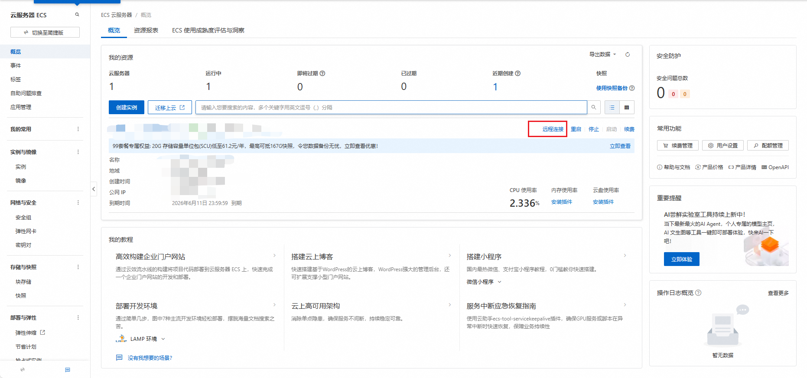

# 复现步骤

## 前置条件

1. 配置好`react-native`环境
2. 安装`android studio`软件
3. 能跑出demo项目
4. 安装`yarn`

## 复现

### 前端

1. git clone项目
2. 创建新项目`npx @react-native-community/cli init ClipPersona --version 0.79.1`
3. 将ClipNova文件夹移动到ClipPersona内，覆盖同名文件
   也可移植到已创建的demo项目运行，但是创建项目的名称必须是ClipPersona
4. 安装依赖包`npm install`
5. 运行`yarn android`

### 后端

后端是视频编辑的程序，不启动后端无法进行视频编辑

1. [登录阿里云服务器](https://ecs.console.aliyun.com/home?accounttraceid=17e8c3f235784dbb8ca94e9f11dfccf3ynie)
2. 点击**远程连接**后再点击**通过Workbench远程连接**

（其他连接方式如vscode连接请自行查询）
3. 运行api程序

```bash
cd Backend
conda activate videoedit
python api_server.py
```
